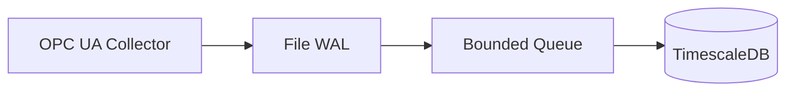
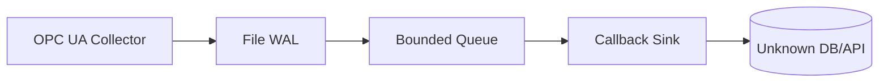
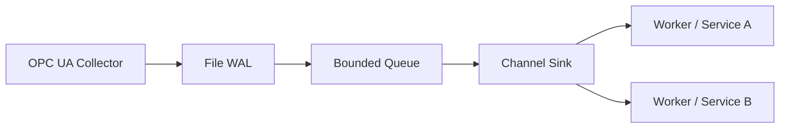

# Examples

Hands-on samples live under this directory so you can see how to wire AegisFlow into different pipelines without starting from scratch.

## 1. Default OPC UA → Timescale (`example/basic`)

Demonstrates the classic deployment: load `data/config.yaml`, keep the built-in OPC UA collector + Timescale sink, and run until the process receives `SIGINT/SIGTERM`.

```bash
go run ./example/basic
```



## 2. Callback sink for unknown databases (`example/callback`)

Streams samples into a simple callback via `StreamOutCallback`. This is perfect when your destination database/API is still experimental: the callback can serialize or batch however it wants before forwarding.

```bash
go run ./example/callback
```



## 3. Channel fan-out (`example/channel`)

Uses `NewChannelSink` so batches land on a Go channel that multiple goroutines (or gRPC servers, message buses, etc.) can consume. Great for bridging AegisFlow into bespoke services or multiple downstream systems at once.

```bash
go run ./example/channel
```



Feel free to copy these snippets as blueprints for your own pipelines—swap in custom collectors, sinks, or transformers using the same `Flow` builder shown above.
