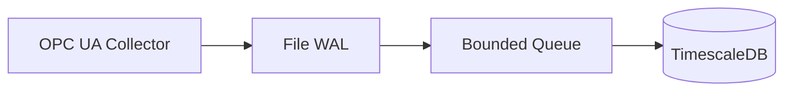

# Example: OPC UA → Timescale (Default)

Demonstrates the out-of-the-box deployment where you only edit `data/config.yaml`, then run AegisFlow with its production-grade collector, WAL, queue, transformer, and Timescale sink.

## Run It

```bash
go run ./example/basic
```

## Flow



## Notes

- Ensure `data/config.yaml` contains valid OPC UA endpoint + Timescale credentials.
- Use this as a baseline before introducing custom collectors/sinks.
