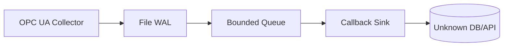

# Example: Callback Sink (Bridge to Unknown DB)

Streams OPC UA telemetry into a simple callback using `StreamOutCallback`. Ideal when your final database or API is still experimental—you can format and forward batches however you like.

## Run It

```bash
go run ./example/callback
```

## Flow



## Notes

- Replace the `fmt.Printf` call in `main.go` with logic that forwards batches to your prototype DB/API.
- When the destination stabilises, you can upgrade the callback into a full `aegisflow.Sink`.
