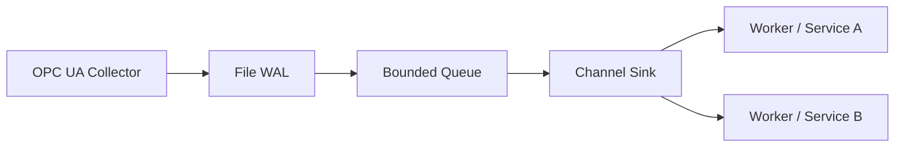

# Example: Channel Fan-out

Uses `NewChannelSink` to push WAL-ordered batches onto a Go channel so multiple goroutines or services can consume the data concurrently.

## Run It

```bash
go run ./example/channel
```

## Flow



## Notes

- Adjust the channel buffer size in `main.go` to control backpressure on the fan-out workers.
- Replace the placeholder `fanoutWorker` with your actual downstream delivery logic.
